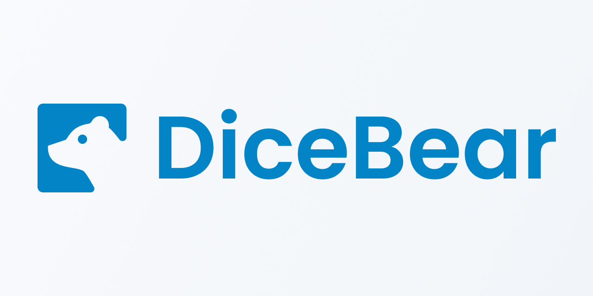

# DICEBEAR

## Introduction

DiceBear is an avatar library for designers and developers. You can choose between simple identicons or lovely designed characters. The goal is to avoid you to waste time by designing your own avatar while dicebear's community have a huge choice of premade avatars. You can also pull request if you want a specific avatar. 
You can upload them in several format like: 
1. PNG
2. JPG
3. SPG
4. With the free HTTP-API (the easiest way)
5. Use the JavaScript library

This is a few example of different avatars you can find on Dicebear:

| Avatar| Description |
| ----------- | ----------- |
| Adventurer| text |
| female| Text | 
|Male|text|

I will analyse this repository from GitHub: [DICEBEAR](https://github.com/dicebear/dicebear)

##Dicebear's Git

- FORKS(TÉLÉCHARGER LE PRJET SUR GIT ET MODIFIER)
- WATCHING(RECEVOIR LES NOTIFS DE MODIFICATION)
- PULL REQUEST OPEN ET CLOSED 
- PEU D'ENTRAIDE ET DE DISCUSSION MAIS BEAUCOUP D'UTILISATEUR
- BEAUCOUP DE VERSIONS TrÈS SOUVENT release
- PARLER DES ISSUES ET DES COMENTAIRES
- LICENSE
- DOCUMENTATION
## Sous title
### Sous Sous title

Modificationhttps://github.com/dicebear/dicebear
Distribution

    Private use

Limitations

Liability
Warrant
